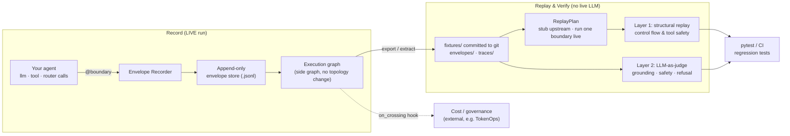

<div align="center">

# Chronicle

**Record-and-replay for agent decision graphs.**<br>
Turn a production agent failure into a committed regression test, and re-run your fix without live LLM calls.

[](https://github.com/theagentplane/chronicle/actions/workflows/ci.yml)
[](https://pypi.org/project/agent-chronicle/)
[](https://pypi.org/project/agent-chronicle/)
[](https://github.com/theagentplane/chronicle/blob/main/LICENSE.txt)
[](https://github.com/astral-sh/ruff)
[](https://github.com/theagentplane/chronicle/stargazers)


[Watch the full walkthrough](https://www.youtube.com/watch?v=Lc8zRh9muoY)

</div>

Chronicle records what your agent did at each decision point (its LLM calls, tool
calls, and routing choices) so you can reproduce a production failure as a committed
regression test and re-run your fix without live LLM calls. It targets one specific,
real problem: control-flow and tool-safety regressions in multi-agent systems, caught
deterministically from recorded incidents.

**New here?** The [step-by-step onboarding guide](https://github.com/theagentplane/chronicle/blob/main/docs/onboarding.md)
walks you from install to a committed regression test.

**[Why](#why-chronicle) · [Quick start](#quick-start) · [Cut-point replay](#cut-point-replay) · [Recording](#recording-entry-points) · [Verification](#verification-layers) · [Compare](#how-chronicle-compares) · [Demos](#demos) · [FAQ](#faq) · [Roadmap](#roadmap)**

<details>
<summary><b>Key terms</b> (boundary, Envelope, trace, fixture, stub, live, cut-point)</summary>

<br>

| Term | What it means |
|---|---|
| **Boundary** | A decision point you mark: an LLM call, a tool call, or a routing choice. You choose which functions are boundaries. |
| **Envelope** | The immutable record of one boundary crossing: its input, its output, and metadata. It records I/O, not the side effects inside the function. |
| **Trace** | One whole run, as an ordered set of Envelopes. |
| **Fixture** | A trace committed to git under `fixtures/traces/`. Your permanent, replayable incident. |
| **Stub** | On replay, hand back a boundary's recorded output *without running its code*. |
| **Live** | Run the boundary's real code (to record it, or, on replay, to run your new code). |
| **Cut-point** | The one boundary you set to **live** during a replay to test a fix, while everything upstream stays **stubbed**. |

</details>

## Why Chronicle

- **Record** every LLM call, tool call, and routing decision as an immutable Envelope.
- **Cut-point replay:** change one boundary, freeze the rest of the incident, and assert deterministically with no LLM calls.
- **Two-layer verification:** structural replay for control flow and tool safety, plus LLM-as-judge for meaning.
- **Commit incidents as regression tests** so a fixed failure never silently returns.
- **Batteries included:** secret redaction, real model-version capture, and LangGraph / OpenInference integration.

## How it works

Chronicle is two systems that share one artifact, the **Envelope**: a recorder that
captures boundary crossings during a live run, and a test bench that replays them
without touching the model.



Each Envelope is an immutable, append-only record of one boundary crossing. It captures
the boundary's **I/O** (input and return value) plus metadata, and treats the function
as a black box: it does **not** capture the side effects inside (file writes, network
calls, database writes, time). That black-box view is why replay is safe and
deterministic.

| Field | Contents |
|---|---|
| Contextual metadata | Model version, sampling parameters, runtime build ID |
| Input state | Assembled prompt, graph state, retrieved context chunks |
| Action / result | Structured tool calls and model completion |
| Graph linkage | `parent_envelope_id`, `sequence`, `invocation_index` for retries |

## Install

```bash
# From PyPI:
pip install agent-chronicle

# From source (development):
pip install -e ".[dev]"
```

## Quick start

**1. Wrap your LLM client.** No decorators. Every model call is recorded, and in
replay it is served back from the fixture with no API call:

```python
import chronicle
from openai import OpenAI

client = chronicle.wrap(OpenAI())
client.chat.completions.create(model="gpt-4o", messages=[...])   # recorded
```

> **What gets captured:** the input and the return value at each boundary (its I/O),
> plus metadata like model version and token usage. Side effects that run *inside* a
> boundary (a real file delete, an API POST, a DB write) are **not** captured, so on
> replay a stubbed boundary returns the recorded output without firing them again.

**2. Or mark your own boundaries** with `@boundary`, for exact control over what counts
as an LLM, tool, or routing decision:

```python
from chronicle import boundary

@boundary("agent", kind="llm")
def agent_plan(state: dict) -> dict:
    ...

@boundary("delete_file", kind="tool")
def delete_file(path: str, environment: str) -> dict:
    ...
```

`@boundary` works on `async def` too, and it is **transparent**: it never changes what
your function returns or raises. A bare `@boundary` records the call by argument name,
so extractors are an optional way to trim payloads, never a requirement.

**3. Record a run and freeze it as a committed fixture** in one block:

```python
import chronicle

with chronicle.record(
    "incident-001",
    store=".chronicle/runs/incident.jsonl",   # raw run, gitignored
    export="fixtures/traces/incident-001/",   # the committed fixture you keep
):
    run_agent(...)
```

### Which entry point should I record with?

Pick by what you already have. All four produce the **same Envelopes** and replay the
same way, so nothing downstream changes.

| You have | Use |
|---|---|
| An OpenAI- or Anthropic-style client | `chronicle.wrap(client)` |
| A function you can edit | `@boundary("name", kind=...)` |
| A model call that is a plain function you pass around | [`wrap_llm("name", fn)`](#recording-entry-points) |
| LangGraph nodes | [`chronicle.instrument_langgraph(nodes)`](#recording-entry-points) |

## Cut-point replay

This is the core move. Test a fix in **one** boundary while the rest of the incident
stays frozen: upstream boundaries are **stubbed** (recorded output, no code runs), your
changed boundary runs **live** (your new code against the real recorded inputs), and you
assert on its result.

```python
import chronicle
from chronicle import ReplayPlan

with chronicle.replay_trace(
    "fixtures/traces/deletion-incident-001/",
    ReplayPlan()
    .stub("agent", 1)          # upstream: frozen from fixture, no LLM call
    .live("delete_file", 1)    # cut-point: run your new, fixed code
    .live("agent", 2)          # downstream: observe the effect
) as session:
    run_agent(...)
    assert session.captured_result("delete_file", 1)["blocked"] is True
```

`.stub(name, n)` and `.live(name, n)` target the *n*-th call to that boundary, so loops
and retries replay correctly.

## Recording entry points

`@boundary` (above) is the explicit way to mark a boundary. Three helpers cover the
cases where you would rather not decorate by hand. All record the same Envelopes and
replay the same way.

<details>
<summary><b><code>wrap(client)</code>: an OpenAI- or Anthropic-style client</b></summary>

<br>

```python
client = chronicle.wrap(OpenAI())
client.chat.completions.create(model="gpt-4o", messages=[...])   # recorded
```

Wraps the client's completion method in place and returns the client. Transparent in
live mode (you get the real response); in replay it returns the recorded response with
attribute and index access (`resp.choices[0].message.content`) and makes no API call.

</details>

<details>
<summary><b><code>wrap_llm(name, fn)</code>: a model call that is a plain function</b></summary>

<br>

Use this when your model call is a plain function you pass around (not a client, and not
a named function you can decorate):

```python
from chronicle import wrap_llm

def complete(model, messages, **kwargs):
    ...                                    # your function that calls the model

complete = wrap_llm("llm", complete)       # now it records and replays
result = complete("gpt-4o", [{"role": "user", "content": "hi"}])
```

- **Live:** runs `complete`, records an `llm` Envelope (with model and token usage).
- **Replay (stubbed):** returns the recorded result without calling `complete`.

It reads `messages` (and `model` / `provider` if present) from the arguments
automatically. Pass `extract_input` only if the signature is unusual.

</details>

<details>
<summary><b><code>instrument_langgraph(nodes)</code>: every LangGraph node at once</b></summary>

<br>

```python
nodes = chronicle.instrument_langgraph({"agent": agent_node, "tools": tool_node})
for name, fn in nodes.items():
    graph.add_node(name, fn)
```

Wraps each node as a `@boundary` in one call (async nodes supported). Use
`kind="llm"` for nodes that call a model so their Envelopes capture model metadata.

</details>

## Verification layers

| Layer | Goal | Mechanism |
|---|---|---|
| Layer 1: replay | Validate control flow and tool safety | Structural assertions over recorded fixtures; never calls the LLM |
| Layer 2: evaluation | Validate generation quality | LLM-as-a-judge on meaning (grounding, safety, refusal), not bitwise equality |
| Cut-point replay | Test a change in one boundary | Stub upstream from fixtures, run the target boundary live |

<details>
<summary><b>Layer 1: single-envelope injector</b></summary>

<br>

```python
from chronicle.replay import ReplayInjector
from chronicle import Envelope

envelope = Envelope.from_file("fixtures/envelopes/incident-2026-06-17-001.json")
injector = ReplayInjector(envelope)

def agent(state, inj):
    inj.stub_llm()
    inj.stub_tool("search_docs", {"query": "reset API key"})
    return {"finish_reason": "tool_calls"}

_, _, assertions = injector.replay(agent)
assert all(a.passed for a in assertions)
```

</details>

<details>
<summary><b>Layer 2: LLM-as-judge</b></summary>

<br>

```python
from chronicle.judge import JudgeRunner, OpenAIJudgeClient

runner = JudgeRunner(OpenAIJudgeClient(model="gpt-4o-mini"))
result = runner.evaluate(envelope)
assert result.overall_passed
```

</details>

## How Chronicle compares

Chronicle is not a tracing dashboard or an eval framework. It is the piece that makes a
recorded agent run **replayable and testable**, and it sits alongside the tools you
already use.

| | Chronicle | LangSmith / Langfuse / Phoenix | promptfoo | VCR.py |
|---|:---:|:---:|:---:|:---:|
| Trace agent runs | ✅ | ✅ | Partial | HTTP only |
| Deterministic replay, no live LLM | ✅ | No | No | ✅ (HTTP) |
| Cut-point: change one boundary, freeze the rest | ✅ | No | No | No |
| Commit incidents as regression tests | ✅ | Via datasets | ✅ | ✅ |
| Structural + LLM-judge verification | ✅ | Judge only | Judge only | No |
| Agent-graph aware (boundaries, retries) | ✅ | ✅ | No | No |

## Demos

Each demo records an incident from an ungated tool, then a cut-point test verifies the
gated fix. All share the `agent@1 -> tool@1 -> agent@2` shape.

| Demo | What goes wrong | Run the cut-point test |
|---|---|---|
| Refund | $9.8M refund on a $47 order (amount read from the order ID) | `python examples/financial_incidents/run.py refund test` |
| Invoice | EUR 2M invoice sent as USD | `python examples/financial_incidents/run.py invoice test` |
| Trade | ~$190k sell instead of ~$1k (notional read as share count) | `python examples/financial_incidents/run.py trade test` |
| Deletion | Ungated `delete_file` wipes prod | `python examples/deletion_agent/run_cutpoint_demo.py` |

<details>
<summary><b>Record the incident, visualize the trace, run the full suite</b></summary>

<br>

```bash
# Financial incidents: record the bad run, then cut-point test the fix
python examples/financial_incidents/run.py refund record
python examples/financial_incidents/run.py all test
pytest tests/test_financial_incidents.py -v

# Deletion agent: record, visualize the trace, cut-point test
python examples/deletion_agent/record_incident.py
python examples/deletion_agent/show_trace.py --ui   # interactive timeline + graph
pytest tests/test_deletion_cutpoint.py -v
```

The gated fix refuses when an amount exceeds a flat cap (`MAX_REFUND_CENTS`,
`MAX_INVOICE_CENTS`, `MAX_ORDER_NOTIONAL_CENTS`). Source lives under
`examples/financial_incidents/` and `examples/deletion_agent/`.

</details>

## Advanced

<details>
<summary><b>CLI reference</b></summary>

<br>

```bash
chronicle record                                    # bootstrap tracing + instrumentation
chronicle extract --trace-id ID                     # export envelopes to fixtures/
chronicle replay FIXTURE.json                       # Layer 1 deterministic replay
chronicle verify FIXTURE.json --layer2 --mock-judge # Layer 1 + Layer 2
chronicle show-graph fixtures/traces/TRACE --ui     # interactive trace visualization
chronicle show-graph TRACE --html out.html          # static HTML export
chronicle schema                                    # print Envelope JSON Schema
chronicle list-fixtures                             # list committed envelope fixtures
```

</details>

<details>
<summary><b>Cost and governance observers (<code>on_crossing</code>)</b></summary>

<br>

Chronicle is the tracer; governors subscribe via `on_crossing`. External systems (for
example TokenOps) attach an observer that fires after each live crossing:

```python
session = reset_session()
session.on_crossing = my_observer  # (boundary_id, kind, input_state, result) -> None
```

It runs after a live envelope record and a live cut-point capture, and does not run on
stub replay. See `tests/test_cost_management_e2e.py` for an end-to-end ledger and budget
pattern.

</details>

<details>
<summary><b>Lower-level recorder (<code>EnvelopeRecorder</code>)</b></summary>

<br>

```python
from chronicle.envelope.capture import EnvelopeRecorder
from chronicle.envelope.store import EnvelopeStore
from chronicle.instrumentation import instrument_graph_nodes

recorder = EnvelopeRecorder(
    store=EnvelopeStore(".chronicle/runs/envelopes.jsonl"),
    model_version="gpt-4o-2024-08-06",
    build_id="deploy-abc123",
)
wrapped_nodes = instrument_graph_nodes(recorder, {"agent": agent_node})
```

See `examples/langgraph_demo/agent.py`.

</details>

<details>
<summary><b>Environment variables</b></summary>

<br>

| Variable | Purpose |
|---|---|
| `CHRONICLE_BUILD_ID` | Pin runtime build ID in envelope metadata |
| `CHRONICLE_STORE` | Default envelope store path |
| `PHOENIX_COLLECTOR_ENDPOINT` | Phoenix OTLP endpoint (default `http://localhost:4317`) |

</details>

<details>
<summary><b>Project structure</b></summary>

<br>

Only `chronicle/` is the installable library. Demos stay under `examples/`; committed
regression traces live in `fixtures/`.

```
chronicle/                 # installable package
├── boundary.py            # @boundary + wrap_llm (record + replay + cut-point)
├── session.py             # runtime session, on_crossing hook, stub/live modes
├── execution_graph.py     # side graph builder (load/save/render)
├── visualizer.py          # HTML trace UI (library + CLI)
├── envelope/              # schema, capture, append-only store
├── replay/                # ReplayPlan, ReplayInjector, structural assertions
├── judge/                 # Layer 2 rubric + LLM-as-judge runner
├── instrumentation/       # OpenInference + LangGraph hooks
└── cli.py
fixtures/                  # committed regression data (envelopes/ · traces/)
examples/                  # demos and test benches (not imported by the package)
tests/                     # unit + e2e
```

</details>

## Roadmap

Chronicle is early (0.x), and the Envelope schema may still change between minor
versions. See [ROADMAP.md](https://github.com/theagentplane/chronicle/blob/main/ROADMAP.md)
for what is planned (streaming capture, compiled-LangGraph auto-instrumentation, a pytest
plugin, and a docs site). Shape priorities in
[Discussions](https://github.com/theagentplane/chronicle/discussions).

## FAQ

### Using Chronicle

<details>
<summary><b>What counts as a boundary, and how many should I add?</b></summary>

A boundary is any decision point you want to be able to freeze and replay: an LLM call,
a tool or function call, or a routing choice. You do not need to wrap everything. Start
with the calls you would actually assert on in a test: the model call that decides an
action, and each tool that has a real effect (a write, a payment, a delete). A boundary
you never stub or assert on just adds an envelope, so add them where a test would look.
</details>

<details>
<summary><b>After I record, how do I write a test?</b></summary>

Open the fixture with `replay_trace(fixture, plan)` in a `with` block, run your agent,
and assert. Two things to read from the session:

- `session.captured_result(boundary_id, invocation_index)` is the return value of a
  boundary you ran **live** (your cut-point).
- `session.call_log()` is every boundary crossing in order, each tagged `record`,
  `stub`, or `live`, so you can assert on control flow (which tools ran, in what order).

See the [Cut-point replay](#cut-point-replay) example.
</details>

<details>
<summary><b>Does replay run my tools and side-effecting code?</b></summary>

A **stubbed** boundary does not run at all: Chronicle returns the recorded output, so no
file is written and no API is called. A boundary you mark `.live()` in a `ReplayPlan`
(the cut-point) **does** run your real code, including its side effects, against the
recorded inputs. So when you cut-point test a destructive tool, run the fixed, gated
version or point it at a sandbox. Everything outside the cut-point stays frozen. (This
is why an Envelope only records a boundary's I/O, never the side effects inside it.)
</details>

<details>
<summary><b>How does replay know which recorded output to return?</b></summary>

By boundary name and invocation index. The first call to `agent` in a run gets the first
recorded `agent` envelope, the second call gets the second, and so on. That is how loops
and retries replay correctly: each crossing is matched to the same-numbered crossing in
the fixture.
</details>

<details>
<summary><b>What if my code takes a different path than the recording?</b></summary>

If your code calls a boundary that has no matching envelope (a brand-new boundary, or one
more invocation than you recorded), Chronicle raises a clear `KeyError` naming the
boundary and index. That is usually the signal you want: the run diverged from the
recorded incident. For the part you intentionally changed, mark it `.live()` so it runs
your new code instead of being matched against the fixture.
</details>

### Behavior and guarantees

<details>
<summary><b>Does replaying call my LLM?</b></summary>

No. Layer 1 replay never calls the model; stubbed boundaries return the outputs recorded
during the live run, so tests are deterministic, free, and fast. Only the optional Layer 2
(LLM-as-judge) makes model calls, and only when you ask it to.
</details>

<details>
<summary><b>Will recording add overhead or change production behavior?</b></summary>

`@boundary` and `wrap()` are **transparent**: they never change what your function
returns or raises. Recording adds one wrapper call and one JSON append per boundary
crossing, so the cost scales with how many boundaries you mark, not with anything in a
hot loop. Enable it where you want a record; leave it off elsewhere.
</details>

<details>
<summary><b>What about non-determinism?</b></summary>

You do not force the model to be deterministic. You record the real run and replay it,
which is the only thing you actually need. (More in the
[write-up](https://dev.to/tisha/your-agent-failed-in-prod-good-luck-reproducing-it-56ci).)
</details>

<details>
<summary><b>What does Chronicle not do?</b></summary>

It reproduces control-flow and tool-safety bugs deterministically. It does not fix a bad
generation: if the model hallucinated, replay serves that back, which is what the Layer 2
judge is for. It is also not a tracing dashboard; see the
[comparison](#how-chronicle-compares).
</details>

### Compatibility

<details>
<summary><b>Which LLM providers does <code>wrap()</code> support?</b></summary>

`wrap()` auto-detects an OpenAI-style client (`.chat.completions.create`) and an
Anthropic-style client (`.messages.create`). For any other SDK, or a custom dispatch
function, use `wrap_llm(name, fn)` or mark the call with `@boundary(..., kind="llm")`.
All three record the same envelopes and replay the same way.
</details>

<details>
<summary><b>Does it work with async / FastAPI?</b></summary>

Yes. `async def` boundaries record, stub, and cut-point exactly like sync ones, and the
session is per-request isolated (a `ContextVar`), so concurrent requests never share a
trace.
</details>

<details>
<summary><b>Does it work with LangGraph?</b></summary>

Yes. `chronicle.instrument_langgraph(nodes)` wraps every node in one call, or decorate
nodes with `@boundary`. Auto-instrumenting a compiled graph (capturing routing and edge
decisions) is on the roadmap.
</details>

<details>
<summary><b>Does it support streaming responses?</b></summary>

Not yet. Streaming and async-generator capture are on the roadmap. Today, record the
assembled (non-streamed) response at the boundary.
</details>

<details>
<summary><b>What Python versions are supported?</b></summary>

Python 3.10 and newer.
</details>

### Operating it

<details>
<summary><b>What about secrets and PII?</b></summary>

Turn on redaction before recording production traffic
(`session.redactors = chronicle.default_redactors()`). Secrets are masked at record time,
before anything is stored or committed, and the structure your tests assert on (roles,
tool names, argument keys) is preserved. Add your own `(str) -> str` redactors for PII.
See [Security](#security).
</details>

<details>
<summary><b>Is it production ready?</b></summary>

Chronicle is early (0.x), and the Envelope schema may still change between minor versions,
so pin a version and re-record if you upgrade across a schema change. The
record / replay / cut-point core is covered by the test suite and drives every demo in
this repo.
</details>

## Talks and writing

Presented at the **AI Engineer World's Fair 2026**.

- [Your Agent Failed in Prod. Good Luck Reproducing It](https://dev.to/tisha/your-agent-failed-in-prod-good-luck-reproducing-it-56ci): why record and replay beats forcing determinism.
- [You Recorded the Incident. Now Prove Your Fix Actually Works](https://dev.to/tisha/you-recorded-the-incident-now-prove-your-fix-actually-works-2cni): cut-point replay, turning an incident into a regression test.

## Contributing

Contributions are welcome. See [CONTRIBUTING.md](https://github.com/theagentplane/chronicle/blob/main/CONTRIBUTING.md)
for dev setup, the DCO sign-off, and the record-and-replay reviewer checklist, and please
read our [Code of Conduct](https://github.com/theagentplane/chronicle/blob/main/CODE_OF_CONDUCT.md).

## Security

Chronicle captures prompts, agent state, and retrieved context, so a recording can
contain secrets. Turn on redaction before recording production traffic:

```python
import chronicle

session = chronicle.reset_session()
session.redactors = chronicle.default_redactors()   # mask API keys, tokens, JWTs
```

Read the data-handling guidance in
[SECURITY.md](https://github.com/theagentplane/chronicle/blob/main/SECURITY.md) and report
vulnerabilities privately per that policy.

## Contributors

Thanks to everyone who has contributed.

[](https://github.com/theagentplane/chronicle/graphs/contributors)

Questions or ideas? Open a [Discussion](https://github.com/theagentplane/chronicle/discussions).

## License

[MIT](https://github.com/theagentplane/chronicle/blob/main/LICENSE.txt) (c) 2026 Susheem Koul and Tisha Chawla.

---

If Chronicle saves you a debugging session, please [⭐ star the repo](https://github.com/theagentplane/chronicle) so more people can find it.

<div align="center">
<sub>Built by <a href="https://www.linkedin.com/in/susheemkoul/">Susheem Koul</a> and <a href="https://www.linkedin.com/in/tisha-chawla/">Tisha Chawla</a></sub>
</div>
