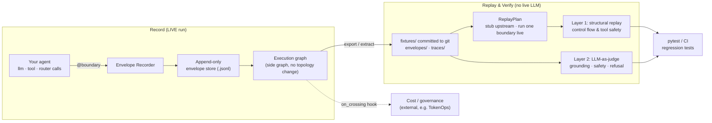

<div align="center">

# Chronicle

**Record-and-replay for agent decision graphs.**<br>
Turn a production agent failure into a committed regression test, and re-run your fix without live LLM calls.

[](https://github.com/theagentplane/chronicle/actions/workflows/ci.yml)
[](https://pypi.org/project/agent-chronicle/)
[](https://pypi.org/project/agent-chronicle/)
[](https://github.com/theagentplane/chronicle/blob/main/LICENSE.txt)
[](https://github.com/astral-sh/ruff)
[](https://github.com/theagentplane/chronicle/stargazers)


[Watch the full walkthrough](https://www.youtube.com/watch?v=Lc8zRh9muoY)

</div>

Chronicle records what your agent did at each decision boundary (its LLM calls, tool
calls, and routing choices) so you can reproduce a production failure as a committed
regression test and re-run your fix without live LLM calls. The target is one specific,
real problem: control-flow and tool-safety regressions in multi-agent systems, caught
deterministically from recorded incidents.

**[Why](#why-chronicle) · [Architecture](#architecture) · [Install](#install) · [Quick start](#quick-start) · [Verification](#verification-layers) · [Demos](#demos) · [Comparison](#how-chronicle-compares) · [CLI](#cli) · [Roadmap](#roadmap)**

## Why Chronicle

- **Record** every LLM call, tool call, and routing decision as an immutable Envelope.
- **Cut-point replay:** change one boundary, freeze the rest of the incident, and assert deterministically with no LLM calls.
- **Two-layer verification:** structural replay for control flow and tool safety, plus LLM-as-judge for meaning.
- **Commit incidents as regression tests** so a fixed failure never silently returns.
- **Batteries included:** secret redaction, real model-version capture, and LangGraph / OpenInference integration.

## Architecture

Chronicle is two systems that share one artifact, the **Envelope**: a recorder
that captures boundary crossings during a live run, and a test bench that
replays them without touching the model.



**The Envelope** is an immutable, append-only record of one boundary crossing:

| Field | Contents |
|---|---|
| Contextual metadata | Model version, sampling parameters, runtime build ID |
| Input state | Assembled prompt, graph state, retrieved context chunks |
| Action / result | Structured tool calls and model completion |
| Graph linkage | `parent_envelope_id`, `sequence`, `invocation_index` for retries |

Optional OpenInference and Arize Phoenix integrations feed framework-agnostic
tracing into this same envelope format.

## Install

```bash
# From source (development):
pip install -e ".[dev]"

# From PyPI:
pip install agent-chronicle
```

## Quick start

Annotate a decision boundary once with `@boundary`; it records in live mode and
stubs from a fixture in replay mode. Record a run, and freeze it as a committed
fixture, in a single block:

```python
import chronicle
from chronicle import boundary

@boundary("agent", kind="llm")
def agent_plan(state: dict) -> dict:
    ...

@boundary("delete_file", kind="tool")
def delete_file(path: str, environment: str) -> dict:
    ...

with chronicle.record(
    "incident-001",
    store=".chronicle/runs/incident.jsonl",
    export="fixtures/traces/incident-001/",
):
    run_agent(...)
```

`record()` wraps `reset_session()`; drop to the session API when you need finer
control.

### Cut-point replay

Test a fix in one boundary while the rest of the incident stays frozen. Upstream
boundaries are stubbed from the fixture, your changed boundary runs live, and you
assert on its captured result.

```python
import chronicle
from chronicle import ReplayPlan

with chronicle.replay_trace(
    "fixtures/traces/deletion-incident-001/",
    ReplayPlan()
    .stub("agent", 1)          # upstream: frozen from fixture
    .live("delete_file", 1)    # cut-point: run new code
    .live("agent", 2)          # downstream: observe the effect
) as session:
    run_agent(...)
    assert session.captured_result("delete_file", 1)["blocked"] is True
```

One decorator, two behaviors: in **live** mode your function runs and its
input/output are recorded into an Envelope; in **replay + stub** mode it does not
run and Chronicle returns the recorded output. A cut-point is the one boundary you
flip back to live to test new code against real upstream inputs.

## Verification layers

| Layer | Goal | Mechanism |
|---|---|---|
| Layer 1: replay | Validate control flow and tool safety | Structural assertions over recorded fixtures; never calls the LLM |
| Layer 2: evaluation | Validate generation quality | LLM-as-a-judge on meaning (grounding, safety, refusal), not bitwise equality |
| Cut-point replay | Test a change in one boundary | Stub upstream from fixtures, run the target boundary live |

### Layer 1 (single-envelope injector)

```python
from chronicle.replay import ReplayInjector
from chronicle import Envelope

envelope = Envelope.from_file("fixtures/envelopes/incident-2026-06-17-001.json")
injector = ReplayInjector(envelope)

def agent(state, inj):
    inj.stub_llm()
    inj.stub_tool("search_docs", {"query": "reset API key"})
    return {"finish_reason": "tool_calls"}

_, _, assertions = injector.replay(agent)
assert all(a.passed for a in assertions)
```

### Layer 2 (LLM-as-judge)

```python
from chronicle.judge import JudgeRunner, OpenAIJudgeClient

runner = JudgeRunner(OpenAIJudgeClient(model="gpt-4o-mini"))
result = runner.evaluate(envelope)
assert result.overall_passed
```

## How Chronicle compares

Chronicle is not a tracing dashboard or an eval framework. It is the piece that makes a
recorded agent run **replayable and testable**, and it sits alongside the tools you
already use.

| | Chronicle | LangSmith / Langfuse / Phoenix | promptfoo | VCR.py |
|---|:---:|:---:|:---:|:---:|
| Trace agent runs | ✅ | ✅ | Partial | HTTP only |
| Deterministic replay, no live LLM | ✅ | No | No | ✅ (HTTP) |
| Cut-point: change one boundary, freeze the rest | ✅ | No | No | No |
| Commit incidents as regression tests | ✅ | Via datasets | ✅ | ✅ |
| Structural + LLM-judge verification | ✅ | Judge only | Judge only | No |
| Agent-graph aware (boundaries, retries) | ✅ | ✅ | No | No |

## Demos

Each demo records an incident from an ungated tool, then a cut-point test verifies the
gated fix. All share the `agent@1 -> tool@1 -> agent@2` shape.

| Demo | What goes wrong | Run the cut-point test |
|---|---|---|
| Refund | $9.8M refund on a $47 order (amount read from the order ID) | `python examples/financial_incidents/run.py refund test` |
| Invoice | EUR 2M invoice sent as USD | `python examples/financial_incidents/run.py invoice test` |
| Trade | ~$190k sell instead of ~$1k (notional read as share count) | `python examples/financial_incidents/run.py trade test` |
| Deletion | Ungated `delete_file` wipes prod | `python examples/deletion_agent/run_cutpoint_demo.py` |

<details>
<summary><b>Record the incident, visualize the trace, run the full suite</b></summary>

```bash
# Financial incidents: record the bad run, then cut-point test the fix
python examples/financial_incidents/run.py refund record
python examples/financial_incidents/run.py all test
pytest tests/test_financial_incidents.py -v

# Deletion agent: record, visualize the trace, cut-point test
python examples/deletion_agent/record_incident.py
python examples/deletion_agent/show_trace.py --ui   # interactive timeline + graph
pytest tests/test_deletion_cutpoint.py -v
```

The gated fix refuses when an amount exceeds a flat cap (`MAX_REFUND_CENTS`,
`MAX_INVOICE_CENTS`, `MAX_ORDER_NOTIONAL_CENTS`). Source lives under
`examples/financial_incidents/` and `examples/deletion_agent/`.

</details>

## CLI

<details>
<summary><b>Command reference</b></summary>

```bash
chronicle record                                    # bootstrap tracing + instrumentation
chronicle extract --trace-id ID                     # export envelopes to fixtures/
chronicle replay FIXTURE.json                       # Layer 1 deterministic replay
chronicle verify FIXTURE.json --layer2 --mock-judge # Layer 1 + Layer 2
chronicle show-graph fixtures/traces/TRACE --ui     # interactive trace visualization
chronicle show-graph TRACE --html out.html          # static HTML export
chronicle schema                                    # print Envelope JSON Schema
chronicle list-fixtures                             # list committed envelope fixtures
```

</details>

## LangGraph integration (optional)

<details>
<summary><b>Wrap LangGraph nodes as an alternative to <code>@boundary</code></b></summary>

```python
from chronicle.envelope.capture import EnvelopeRecorder
from chronicle.envelope.store import EnvelopeStore
from chronicle.instrumentation import instrument_graph_nodes

recorder = EnvelopeRecorder(
    store=EnvelopeStore(".chronicle/runs/envelopes.jsonl"),
    model_version="gpt-4o-2024-08-06",
    build_id="deploy-abc123",
)
wrapped_nodes = instrument_graph_nodes(recorder, {"agent": agent_node})
```

See `examples/langgraph_demo/agent.py`.

</details>

## Cost and governance observers (`on_crossing`)

Chronicle is the tracer; governors subscribe via `on_crossing`. External systems
(for example TokenOps) attach an observer that fires after each live crossing:

```python
session = reset_session()
session.on_crossing = my_observer  # (boundary_id, kind, input_state, result) -> None
```

It runs after a live envelope record and a live cut-point capture, and does not
run on stub replay. See `tests/test_cost_management_e2e.py` for an end-to-end
ledger and budget pattern.

### Wrapping LLM dispatch (`wrap_llm`)

When the LLM entry point is a callable (not a decorate-able function), use
`wrap_llm` — same record + `on_crossing` contract as `@boundary(..., kind="llm")`:

```python
from chronicle import wrap_llm

def complete(provider, model, messages, **kwargs):
    ...

traced = wrap_llm("agent.chat", complete)
# LIVE: executes, records envelope kind=llm, fires on_crossing
# REPLAY stub: returns fixture without calling complete
result = traced("openai", "gpt-4o-mini", [{"role": "user", "content": "hi"}])
```

Also accepts `(messages) -> result`. Pass `extract_input` / `extract_result` /
`extract_metadata` when the signature differs.

## Environment variables

| Variable | Purpose |
|---|---|
| `CHRONICLE_BUILD_ID` | Pin runtime build ID in envelope metadata |
| `CHRONICLE_STORE` | Default envelope store path |
| `PHOENIX_COLLECTOR_ENDPOINT` | Phoenix OTLP endpoint (default `http://localhost:4317`) |

## Project structure

Only `chronicle/` is the installable library. Demos and interactive benches stay
under `examples/`; committed regression traces live in `fixtures/`.

```
chronicle/                 # installable package
├── boundary.py            # @boundary + wrap_llm (record + replay + cut-point)
├── session.py             # runtime session, on_crossing hook, stub/live modes
├── execution_graph.py     # side graph builder (load/save/render)
├── visualizer.py          # HTML trace UI (library + CLI)
├── envelope/              # schema, capture, append-only store
├── replay/                # ReplayPlan, ReplayInjector, structural assertions
├── judge/                 # Layer 2 rubric + LLM-as-judge runner
├── instrumentation/       # OpenInference + LangGraph hooks
└── cli.py
fixtures/                  # committed regression data (envelopes/ · traces/)
examples/                  # demos and test benches (not imported by the package)
scripts/                   # demo and test runners
tests/                     # unit + e2e
```

## Talks and writing

This work was presented at the **AI Engineer World's Fair 2026**.

- [Your Agent Failed in Prod. Good Luck Reproducing It](https://dev.to/tisha/your-agent-failed-in-prod-good-luck-reproducing-it-56ci): why record and replay beats forcing determinism.
- [You Recorded the Incident. Now Prove Your Fix Actually Works](https://dev.to/tisha/you-recorded-the-incident-now-prove-your-fix-actually-works-2cni): cut-point replay, turning an incident into a regression test.

## Roadmap

Chronicle is early (0.x), and the Envelope schema may still change. Near-term:

- Drop-in provider capture: `chronicle.wrap(client)` for OpenAI and Anthropic.
- Async `@boundary` for async agents and graph nodes.
- A pytest plugin so a committed incident becomes a one-decorator regression test.
- One-call LangGraph instrumentation and a documentation site.

Ideas and priorities are welcome in [Discussions](https://github.com/theagentplane/chronicle/discussions).

## Contributing

Contributions are welcome. See [CONTRIBUTING.md](https://github.com/theagentplane/chronicle/blob/main/CONTRIBUTING.md) for dev setup,
the DCO sign-off, and the record-and-replay reviewer checklist, and please read
our [Code of Conduct](https://github.com/theagentplane/chronicle/blob/main/CODE_OF_CONDUCT.md).

## Security

Chronicle captures prompts, agent state, and retrieved context, so a recording can
contain secrets. Turn on redaction before recording production traffic, so nothing
sensitive reaches a committed fixture:

```python
import chronicle

session = chronicle.reset_session()
session.redactors = chronicle.default_redactors()   # mask API keys, tokens, JWTs
```

Redaction runs at record time and keeps the structure your tests assert on (message
roles, tool names, argument keys) while masking the values. Add your own
`(str) -> str` redactors for PII. Read the data-handling guidance in
[SECURITY.md](https://github.com/theagentplane/chronicle/blob/main/SECURITY.md) and report vulnerabilities privately per that policy.

## Contributors

Thanks to everyone who has contributed.

[](https://github.com/theagentplane/chronicle/graphs/contributors)

Questions or ideas? Open a [Discussion](https://github.com/theagentplane/chronicle/discussions).
For security issues, follow [SECURITY.md](https://github.com/theagentplane/chronicle/blob/main/SECURITY.md).

## License

[MIT](https://github.com/theagentplane/chronicle/blob/main/LICENSE.txt) (c) 2026 Susheem Koul and Tisha Chawla.

---

If Chronicle saves you a debugging session, please [⭐ star the repo](https://github.com/theagentplane/chronicle) so more people can find it.

<div align="center">
<sub>Built by <a href="https://www.linkedin.com/in/susheemkoul/">Susheem Koul</a> and <a href="https://www.linkedin.com/in/tisha-chawla/">Tisha Chawla</a></sub>
</div>
