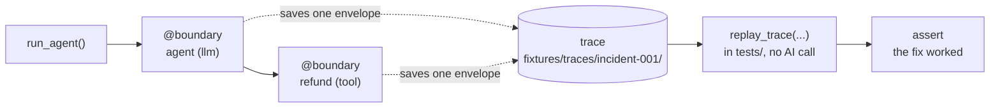
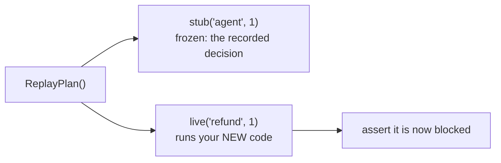

# Onboarding: record and replay your agent

This guide assumes you have never used Chronicle. It explains every word and shows
exactly which file each piece of code goes in. By the end you will have saved a run
of your agent, played it back with no AI call, tested a fix against the real bug,
and turned it into a test that runs forever.

## What is Chronicle, in one sentence

Chronicle is a **flight recorder for your AI agent**. It saves what your agent did,
so you can play it back later, without calling the AI again, to reproduce a bug and
prove your fix.

## Words you will see (plain English)

| Word | What it means |
|---|---|
| **LLM / model** | The AI, like GPT-4. It generates text and decides what to do. |
| **Tool** | A normal function your agent can call: `search`, `refund`, `delete_file`. |
| **Agent** | Your program that asks the model what to do, calls tools, and repeats. |
| **Boundary** | One decision point: a single model call, or a single tool call. **You tell Chronicle which of your functions are boundaries.** |
| **Envelope** | The saved record of **one boundary**: its input and its output. Like one photo. |
| **Trace** | All the envelopes from **one run**, in order. Like an album of the whole run. |
| **Fixture** | A trace saved into your project and committed to git, so it can be used as a test. |
| **Record** | Run your agent once and save everything (produces a trace). |
| **Replay** | Run the saved trace again. The model does **not** run; Chronicle hands back the saved answers. Fast, free, and identical every time. |
| **stub** | During replay: a boundary that returns its **saved** answer (frozen). |
| **live** | During replay: a boundary that **actually runs your code**. |
| **Cut-point** | Freeze everything (stub) except the one function you fixed (live), to test the fix against the real bug. |
| **pytest** | The standard tool that runs your Python tests automatically (locally and in CI). |

Do not worry if some are fuzzy now. They will make sense as you go.

The whole idea in one picture:



---

## Before you start: what is `run_agent(...)`?

Throughout this guide, `run_agent(...)` means **your own function that runs your
agent one time.** Chronicle does not give you this; you already have some way to
run your agent, and that is `run_agent`.

Here is a tiny complete agent so the examples are concrete. Put it in a file called
`agent.py`:

```python
# agent.py  (this is YOUR code)
from openai import OpenAI

client = OpenAI()

def agent(state):
    "Ask the model. It decides to call the refund tool."
    resp = client.chat.completions.create(model="gpt-4o", messages=state["messages"])
    # (in a real agent you would parse resp; we hardcode the decision to keep it short)
    return {"tool": "refund", "order_id": "A-4471", "amount_cents": 9_800_000}

def refund(order_id, amount_cents):
    "The tool that moves money. Today it has a bug: no limit."
    return {"status": "refunded", "amount_cents": amount_cents}

def run_agent(question):
    "Run the whole agent once. THIS is run_agent."
    decision = agent({"messages": [{"role": "user", "content": question}]})
    return refund(decision["order_id"], decision["amount_cents"])
```

The bug: the model asked to refund **$98,000** on a $47 order, and `refund` had no
limit, so it went through. We will record this, then prove a fix.

---

## Step 1: Install

In your terminal:

```bash
pip install agent-chronicle
```

Then, in any Python file, you can write `import chronicle`. That is the whole
install. (You need Python 3.10 or newer.)

---

## Step 2: Tell Chronicle which functions are boundaries

Chronicle cannot guess which of your functions are the important decision points.
**You** point them out. There are three ways. Use whichever matches your code.

### Way A: the model call (wrap the client)

If you use an OpenAI or Anthropic client, wrap it **once, on the line where you
create it.** After that, every call it makes is recorded. No decorators.

```python
# agent.py
import chronicle
from openai import OpenAI

client = chronicle.wrap(OpenAI())   # <-- the only change
```

Using a different provider (Gemini, Cohere, a local model)? See "Other providers"
at the bottom.

### Way B: your tool functions (add one decorator)

Put `@boundary(...)` on the line **above** each function you care about. You give
it a **name** (any short unique string) and a **kind** (`"llm"`, `"tool"`, or
`"custom"`). Nothing else in your function changes.

```python
# agent.py
from chronicle import boundary

@boundary("refund", kind="tool")     # <-- the only change to this function
def refund(order_id, amount_cents):
    ...
```

That is all "adding a boundary" means: one decorator, a name, and a kind.

### Way C: LangGraph (one call, all nodes)

If you use LangGraph, do not decorate each node. Wrap them all at once:

```python
import chronicle

nodes = chronicle.instrument_langgraph({"agent": agent_node, "tools": tool_node})
for name, fn in nodes.items():
    graph.add_node(name, fn)
```

**Which do I use?** Wrap the client (Way A) for the model call, and add `@boundary`
(Way B) to the tool functions you want to check. For LangGraph, just Way C.

### When exactly is a record (an "envelope") created?

One envelope is created **per boundary call, the moment that call finishes**:

```
you call refund(...)
   -> Chronicle notes the INPUT (the arguments)
   -> your function runs and returns
   -> Chronicle saves the ENVELOPE (input + output + which model, when, etc.)  <-- here
   -> your real return value comes back to you, unchanged
```

Call `agent` once and `refund` once = **2 envelopes**. A tool called 3 times in a
loop = **3 envelopes**. Chronicle never changes what your function returns; it just
watches and saves.

---

## Step 3: Record a run

Now run your agent inside a `with chronicle.record(...)` block. This runs your
agent normally **and** saves the trace. Put this in a small script, for example
`scripts/record_incident.py`:

```python
# scripts/record_incident.py  (run this once, by hand)
import chronicle
from agent import run_agent

with chronicle.record(
    "incident-001",                                 # a name for this trace
    export="fixtures/traces/incident-001/",         # where to save it (see below)
):
    run_agent("please refund order A-4471")
```

Run it once:

```bash
python scripts/record_incident.py
```

You now have a saved trace in `fixtures/traces/incident-001/`. Commit that folder
to git. It is the permanent record of the bug.

---

## Step 4: Play it back (replay)

Replay runs the trace again, but **the model never runs** and no tool side effect
happens; each boundary just hands back what it saved. This proves you can
reproduce the run exactly:

```python
import chronicle
from agent import run_agent

with chronicle.replay_trace("fixtures/traces/incident-001/") as session:
    run_agent("please refund order A-4471")   # same call; no AI, no real refund
```

Nothing new is saved to disk here. This step is just to confirm the recording
works.

---

## Step 5: Fix the bug, then prove it with a cut-point test

First, fix the code. Add a limit to `refund`:

```python
# agent.py
MAX_REFUND_CENTS = 1_000_000   # $10,000 cap

@boundary("refund", kind="tool")
def refund(order_id, amount_cents):
    if amount_cents > MAX_REFUND_CENTS:
        return {"status": "blocked", "reason": "over the limit"}
    return {"status": "refunded", "amount_cents": amount_cents}
```

Now prove the fix against the **real** incident. This is the cut-point:

```python
import chronicle
from chronicle import ReplayPlan
from agent import run_agent

with chronicle.replay_trace(
    "fixtures/traces/incident-001/",
    ReplayPlan()
    .stub("agent", 1)       # keep the model's exact decision from the incident
    .live("refund", 1)      # run your NEW refund() for real, on that exact input
) as session:
    run_agent("please refund order A-4471")
    result = session.captured_result("refund", 1)   # what your new refund() returned
    assert result["status"] == "blocked"
```

**What are `stub` and `live`?**

- **stub** = frozen. The boundary does not run; Chronicle returns the answer it
  saved. Use it for everything **before** the part you fixed, so the inputs are
  exactly the same as the real bug.
- **live** = real. The boundary runs your current code. Use it for the one function
  you are fixing.



So your new `refund` sees the exact $98,000 request from the incident, and you
check that it is now blocked. No AI call, and it is the same every time.

---

## Step 6: Turn it into a test that runs forever

Move Step 5 into a test file. A "test" is just a function whose name starts with
`test_`, that uses `assert`. `pytest` finds and runs these automatically.

```python
# tests/test_refund_incident.py
import chronicle
from chronicle import ReplayPlan
from agent import run_agent

def test_refund_is_capped():
    with chronicle.replay_trace(
        "fixtures/traces/incident-001/",
        ReplayPlan().stub("agent", 1).live("refund", 1),
    ) as session:
        run_agent("please refund order A-4471")
        assert session.captured_result("refund", 1)["status"] == "blocked"
```

Run your tests:

```bash
pytest
```

Commit this test **and** the `fixtures/traces/incident-001/` folder. From now on,
every time anyone changes the code, `pytest` re-runs this. If someone breaks the
limit again, the test fails on their pull request, before it reaches a customer.

---

## Where does everything get stored?

| Step | What is written, and where |
|---|---|
| **Record** | The trace, into `fixtures/traces/<name>/` (a folder with one JSON file per boundary, plus `graph.json`). **Commit this.** Optionally also a raw log at `.chronicle/runs/<name>.jsonl` (a scratch file; it is gitignored, so it is not committed). |
| **Replay** | Nothing new on disk. The results live in memory during the test: `session.captured_result(name, n)` and `session.call_log()`. |
| **Verify** | Nothing new on disk. Layer 1 is a `pytest` pass or fail. The optional LLM judge (below) returns a score in memory. You can save an HTML view with `chronicle show-graph <trace> --html out.html`. |

Recording can capture secrets (prompts, arguments). Before recording real
production traffic, turn on redaction so secrets are removed before anything is
saved: `session.redactors = chronicle.default_redactors()`.

## Your project ends up looking like this

```
your-project/
├── agent.py                              # your agent, with @boundary / wrap
├── scripts/record_incident.py            # run once to record
├── fixtures/traces/incident-001/         # the saved trace (committed)
└── tests/test_refund_incident.py         # the regression test (runs in CI)
```

---

## When do I need the "LLM judge"?

Steps 4 to 6 check **structure**: did the right tool run, with the right numbers,
and was the bad action blocked. That is exact and free, and covers most fixes.

But if your fix changes a **prompt or the model**, the new answer is *text* that
should be *as good*, not word-for-word identical, so you cannot just compare
strings. For that, Chronicle can ask a second model to **judge** whether the new
answer still means the same thing (is it grounded, safe, correct):

```python
from chronicle.judge import JudgeRunner, OpenAIJudgeClient

result = JudgeRunner(OpenAIJudgeClient(model="gpt-4o-mini")).evaluate(envelope)
assert result.overall_passed
```

This one **does** call a model (the judge), so use it only when a structural check
cannot answer the question.

---

## Other providers (not OpenAI or Anthropic)

`chronicle.wrap(client)` only knows the OpenAI and Anthropic response shapes. For
any other provider, do not wrap the client. Instead wrap the **function that makes
the call**:

```python
from chronicle import wrap_llm

def call_gemini(messages):
    ...   # your call to any provider

chat = wrap_llm("llm", call_gemini)   # then use chat(messages=[...]) everywhere
```

Or write a small function around the call and put `@boundary("llm", kind="llm")` on
it. (Streaming responses, `stream=True`, are not supported by `wrap` yet.)

---

## The whole thing in one line

**Install -> mark boundaries -> record once -> replay to reproduce -> cut-point
test the fix -> commit the test.**

Stuck? Open a [Discussion](https://github.com/theagentplane/chronicle/discussions)
or read the [FAQ](https://github.com/theagentplane/chronicle#faq).
