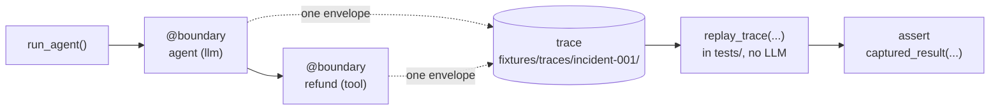
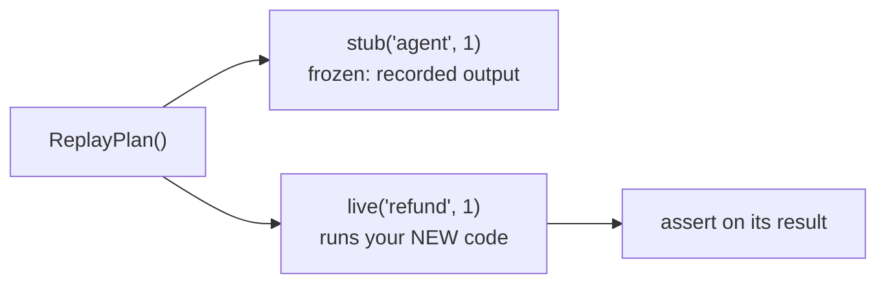

# Onboarding: record and replay your agent

A step-by-step guide, no assumptions. By the end you will have recorded a run,
replayed it with no LLM call, tested a fix against the real incident, and turned
it into a permanent test.

## 0. The one idea

An agent (or a multi-agent system) is a series of **decisions**:

- an **LLM call** (the model decides what to do),
- a **tool call** (`search`, `query_db`, `refund`, ...),
- a **routing / hand-off** (which agent or node runs next).

Chronicle calls each decision a **boundary** and records what crossed it (the
input and the output). A whole run is a **trace** (the ordered boundaries).

**Your only job is to tell Chronicle which functions are boundaries.** That is the
setup. Everything else is record and replay on top.

The whole loop at a glance:



---

## Step 1: Install

```bash
pip install agent-chronicle
```
```python
import chronicle
```
Requires Python 3.10+. Nothing else to configure.

---

## Step 2: Mark your boundaries

You mark boundaries because only you know which functions are the meaningful
decision points. There are three ways; use whichever fits your code.

| Your setup | Do you mark manually? | How |
|---|---|---|
| The **LLM call** (any framework) | No | `client = chronicle.wrap(OpenAI())` |
| Your **tool / step functions** (plain Python) | Yes, one decorator each | `@boundary("refund", kind="tool")` |
| **LangGraph** | No | `chronicle.instrument_langgraph(nodes)` |

**a) The LLM call: wrap the client where you create it.** No decorators:

```python
from openai import OpenAI
import chronicle

client = chronicle.wrap(OpenAI())   # do this once, where you build the client
# every client.chat.completions.create(...) is now recorded
```

**b) Your tool / step functions: one decorator on the definition:**

```python
from chronicle import boundary

@boundary("refund", kind="tool")            # name it; kind is "llm" | "tool" | "custom"
def refund(order_id: str, amount_cents: int) -> dict:
    ...
```

**c) LangGraph: one call wraps every node:**

```python
import chronicle

nodes = chronicle.instrument_langgraph({"agent": agent_node, "tools": tool_node})
for name, fn in nodes.items():
    graph.add_node(name, fn)
```

`@boundary` never changes what your function returns or raises, and it works on
`async def` too, so this is safe to leave on in production.

---

## A few things people ask here

**1. What is `run_agent(...)`?** It is **your** function that runs your agent one
time. Chronicle does not provide it; it is a stand-in for however you already
invoke your agent. For the example above it might be:

```python
def run_agent(question):
    decision = agent({"messages": [{"role": "user", "content": question}]})
    args = decision["tool_calls"][0]["arguments"]
    return refund(args["order_id"], args["amount_cents"])
```

`run_agent("refund order A-4471")` runs the whole flow. Because `agent` and
`refund` are boundaries, each call is captured. **The same `run_agent` is used for
record and for replay** - you never write two versions. Chronicle just switches
behavior based on the mode.

**2. Where does this code live? Inside your own repo.** Chronicle is a library you
`pip install`; everything here is your code:

- **Record** runs wherever you run your agent: a small script (e.g.
  `scripts/record_incident.py`), your app, or a notebook. You record once, to
  capture an incident.
- **Replay and cut-point tests** live in your **test suite** (`tests/`) and run
  under `pytest` on every commit.
- The **boundaries** are your own functions; the **fixtures** (`fixtures/traces/`)
  are committed in your repo. Nothing runs "outside" - Chronicle just wraps your
  functions.

**3. When is an envelope created?** One envelope, per boundary call, the instant
that call finishes:

```
you call agent(state)
   -> Chronicle captures the INPUT (the arguments)
   -> your function runs and returns (or raises)
   -> Chronicle builds the ENVELOPE (input + output + metadata)   <-- formed here
   -> appends it to the trace, and returns your real result
```

Call `agent` once and `refund` once -> 2 envelopes. A boundary called 3 times in a
loop -> 3 envelopes (invocation 1, 2, 3). An envelope is the input and output of
one crossing plus context; it does not capture the inside of your function.

**4. What exactly do I add for a boundary?** Just the decorator: a **name** and a
**kind**. Nothing else in your function changes.

```python
from chronicle import boundary

@boundary("refund", kind="tool")   # name: any unique string; kind: "llm" | "tool" | "custom"
def refund(order_id, amount_cents):
    ...
```

The name is how you refer to it later (`ReplayPlan().stub("refund", 1)`). `kind`
only affects metadata: `"llm"` also auto-captures the model version and sampling
params from the result.

**5. Does `wrap` work for other LLM providers?** `chronicle.wrap(client)`
understands two response shapes out of the box:

- **OpenAI**: `client.chat.completions.create(...)`
- **Anthropic**: `client.messages.create(...)`

For any other provider or call shape (Gemini, Cohere, a local model, a custom HTTP
client), wrap the **callable** instead of the client:

```python
from chronicle import wrap_llm

chat = wrap_llm("llm", my_completion_fn)   # then call chat(messages=[...]) as usual
```

or put a thin function around the call and decorate it with
`@boundary("llm", kind="llm")`. (Streaming with `stream=True` is not handled by
`wrap` yet.)

---

## Step 3: Record a run

Wrap the run you want to capture:

```python
with chronicle.record(
    "incident-001",
    store=".chronicle/runs/incident.jsonl",        # raw log (optional)
    export="fixtures/traces/incident-001/",         # the committed fixture
):
    run_agent(...)                                   # runs normally, and is recorded
```

- `store=` writes the raw run as it happens (survives a crash). Optional.
- `export=` writes the trace you keep and commit. This is what makes a test.

---

## Step 4: Replay to reproduce

Load the trace and run again. **No LLM call**: each boundary returns its recorded
output:

```python
with chronicle.replay_trace("fixtures/traces/incident-001/") as session:
    run_agent(...)     # deterministic reproduction; the model never runs
```

---

## Step 5: Fix, then cut-point test

Change the boundary you are fixing (e.g. cap the refund). Now prove the fix
against the real incident: freeze everything upstream, run your new code live,
assert:

```python
from chronicle import ReplayPlan

with chronicle.replay_trace(
    "fixtures/traces/incident-001/",
    ReplayPlan()
    .stub("agent", 1)          # freeze the model's exact decision from the incident
    .live("refund", 1),        # run your NEW refund() live, on those exact inputs
) as session:
    run_agent(...)
    assert session.captured_result("refund", 1)["blocked"] is True
```

**What are `stub` and `live`?** They are the two settings a `ReplayPlan` puts on a
boundary:

- **stub** = the boundary does **not** run; Chronicle returns the output it
  recorded. The step is frozen to exactly what happened in the incident.
- **live** = the boundary **runs your current code**.

So you `stub` everything upstream (to reproduce the exact inputs), and set the one
boundary you are fixing to `live`. With plain `replay_trace(trace)` and no plan,
**every** boundary is stubbed.



Your fix sees the exact inputs that caused the incident, deterministically, with no
LLM cost.

---

## Step 6: Commit it as a test

Put Step 5 in `tests/` and commit the `fixtures/traces/` folder:

```python
# tests/test_refund_incident.py
def test_refund_is_capped():
    with chronicle.replay_trace(
        "fixtures/traces/incident-001/",
        ReplayPlan().stub("agent", 1).live("refund", 1),
    ) as session:
        run_agent(...)
        assert session.captured_result("refund", 1)["blocked"] is True
```

`pytest` runs it on every commit. If the guard ever breaks again, CI turns red on
the pull request, not on a customer.

---

## Where outputs are stored

| Stage | Written to | Notes |
|---|---|---|
| **Record** | `fixtures/traces/<name>/` (committed) and `.chronicle/runs/*.jsonl` (gitignored) | The fixture is `graph.json` + one JSON file per boundary. The `.jsonl` is the raw scratch log. |
| **Replay** | nothing new on disk | Results live in the session: `session.captured_result(id, n)`, `session.call_log()`. |
| **Verify** | test result / scores | Layer 1 is a `pytest` pass/fail; Layer 2 (judge) returns scores in memory. Optional HTML view: `chronicle show-graph <trace> --html out.html`. |

`.chronicle/runs/` is gitignored by default (scratch); `fixtures/` is committed
(the incidents you keep). Redact before committing production traffic:
`session.redactors = chronicle.default_redactors()`.

---

## When is the LLM-as-judge needed?

Steps 4-5 (Layer 1 replay) check **structure**: right tool, right arguments, was
the dangerous action blocked. That is exact and free. If your fix is a **prompt or
model change**, the new output is text that should be *as good*, not identical, so
equality assertions do not work. That is Layer 2:

```python
from chronicle.judge import JudgeRunner, OpenAIJudgeClient

result = JudgeRunner(OpenAIJudgeClient(model="gpt-4o-mini")).evaluate(envelope)
assert result.overall_passed
```

Layer 1 proves the machinery; Layer 2 proves the words. Layer 2 does call a model
(the judge), so use it only when structure cannot answer the question.

---

## The loop, in one line

**Install → Mark boundaries → Record → Replay → Cut-point test → Commit.**

More questions? See the [FAQ](https://github.com/theagentplane/chronicle#faq) or
open a [Discussion](https://github.com/theagentplane/chronicle/discussions).
